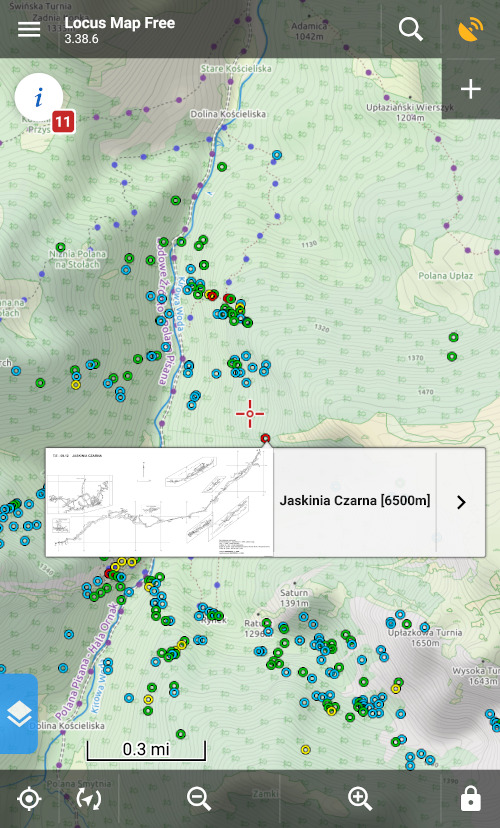

# caves-kml
Tool for dumping [Jaskinie PGI](http://geoportal.pgi.gov.pl/jaskinie_polski) database into KML/KMZ file suitable for offline browsing in Locus.

## Features
- Jaskinie PGI data dump (full, including plans and photos)
- Links to Wikipedia (partial)
- Links to technical sketch (full)
- Links to epimenides pages (partial)

## Points style indicators
| color | cave total length |
|-------|-------------------|
| 🔵 blue | length unknown or < 10m |
| 🟢 green | 10m <= length < 100m |
| 🟡 yellow | 100m <= length < 1000m |
| 🔴 red | 1000m <= length |

## Compatybility
- [Locus Maps](https://play.google.com/store/apps/details?id=menion.android.locus)
- [Google Earth](https://earth.google.com/)
